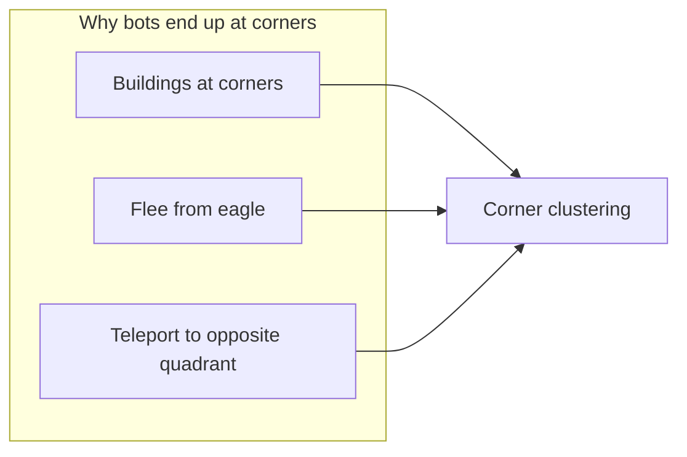

# Smooth Lovable updates: bots, tips, eagles, mobile UI

## Context from [.lovable/plan.md](c:\Users\mongk\Desktop\firechick.lovable\plan.md)

The intended bot system lives in `[src/lib/botAI.ts](c:\Users\mongk\Desktop\firechick\src\lib\botAI.ts)`, driven from `[src/hooks/useGameLogic.ts](c:\Users\mongk\Desktop\firechick\src\hooks\useGameLogic.ts)`, with lobby helpers in `[src/hooks/useGameRoom.ts](c:\Users\mongk\Desktop\firechick\src\hooks\useGameRoom.ts)` and UI in `[src/pages/Host.tsx](c:\Users\mongk\Desktop\firechick\src\pages\Host.tsx)`.

---

## 1. Mobile eagle cooldown (attack + fly/cage)

**Current state:** `[src/components/AttackButton.tsx](c:\Users\mongk\Desktop\firechick\src\components\AttackButton.tsx)` and inline `PropsBtn` in `[src/pages/Client.tsx](c:\Users\mongk\Desktop\firechick\src\pages\Client.tsx)` already use `overflow-visible` on the round buttons so SVG rings are not clipped by `rounded-full`.

**If rings still disappear on device:** trace **parent** `overflow-hidden` / `rounded-`* wrappers in the eagle column (flex parents, safe-area containers). Fix by lifting `overflow-visible` to the immediate flex wrapper of the bottom button row or adding horizontal padding so the ring is not clipped by the viewport edge. Optionally mirror whatever layout the detention path uses if that row already looks correct.

**Small polish:** ensure the cooldown `<svg>` uses the same sizing pattern on attack vs props (both use `absolute inset-0` + `pointerEvents: 'none'`) so behavior matches across breakpoints.

---

## 2. “Two eagle colors” (Black + Gold) vs detention

**Detention rules:** Cage applies only to **chicks** (`!isEagle`, `cagedUntil`). Eagles are never caged.

**Product decision (your change):** Treat **Black** and **Gold** as **eagle-only palette** — do not assign those indices to **chick** role in any game mode. That removes the “two eagle-colored bodies, one detained” confusion: only eagle-colored players are eagles, and only chicks can be detained. Implementation is **not** “set `isEagle` from `colorIndex`” alone (role must still come from `game-start` assignments); instead **enforce allocation**: `EAGLE_COLOR_INDICES` may only be used when `isEagle === true` at lobby + game start. Today **2v6** uses `excludeIndices: []` for chicks, so chicks can still take Black/Gold — that path must be tightened (`[useGameRoom](c:\Users\mongk\Desktop\firechick\src\hooks\useGameRoom.ts)` `allocateColor`, `[ColorPicker](c:\Users\mongk\Desktop\firechick\src\components\ColorPicker.tsx)`, `game-start` assignments).

**Residual UX:** Nametag 🦅 vs 🐤; optional later: `isEagle` prop on `CharacterViewer` for a distinct silhouette.

---

## 3. Bots rushing to the four corners

**Not wrap-around:** The playfield is bounded (`[MAP_HALF](c:\Users\mongk\Desktop\firechick\src\lib\gameplayMapData.ts)`); there is no toroidal wrap in movement. **Buildings are explicitly at the four corners** (`[BUILDINGS](c:\Users\mongk\Desktop\firechick\src\lib\gameplayMapData.ts)` at ±22, ±22). Stage 1–2 chick bots path toward the **nearest glowing building** (`[botAI.ts](c:\Users\mongk\Desktop\firechick\src\lib\botAI.ts)` ~395–431), so **multiple bots naturally occupy different corners**.

**Stacked with flee:** When the eagle is within `FLEE_RADIUS` (12), chick bots enter flee mode (~350–363) and run away from the eagle, which also pushes them toward the edges.

**Tuning directions (pick one or combine):**

- Reduce flee aggressiveness for bots only (e.g. smaller radius or lower speed multiplier when `isBot`).
- In stage 1–2, when **not** in immediate danger, **suppress flee** or blend flee vector with objective (e.g. 70% toward building, 30% away from eagle) so they do not abandon objectives.
- Teleport target in `[botAI.ts](c:\Users\mongk\Desktop\firechick\src\lib\botAI.ts)` (~323–328) uses `±(10 + random)` — clamp targets with `MAP_HALF` and margin so bots do not hug the absolute edge as often.
- **Bug:** Bot chicks can get stuck in the teleport-choosing state — ensure the same `teleport-set` / `teleport-confirm` sequence humans use completes in one frame for bots (or call the same handler path so `teleportPending` clears reliably).
- Replace direct **mutating** `nc.tips[...] = true` for bot-to-bot tip exchange (~407–414) with proper `handleClientMessage` flows or a small host helper so tips and scores stay consistent with the rest of the rules.

---

## 4. Tip sharing: tap “Tips 2” does nothing / no send-receive

**Relevant code paths:**

- Tap → `[handleTipTap](c:\Users\mongk\Desktop\firechick\src\pages\Client.tsx)` → `tip-request` (blocked if either `loadingTip[0]` **or** `loadingTip[1]` is true — line ~692).
- Host → `tip-request` in `[useGameLogic](c:\Users\mongk\Desktop\firechick\src\hooks\useGameLogic.ts)` (~1491–1522): requires **another alive chick within** `[TIP_SHARE_RADIUS](c:\Users\mongk\Desktop\firechick\src\lib\gameplayMapData.ts)`, else `tip-reject` / “Move closer…”
- After QR is active, `[activeTipShares` maintenance](c:\Users\mongk\Desktop\firechick\src\hooks\useGameLogic.ts) (~536–553) **deletes** the active share if no other chick is within radius of the **sharer** — so if bots or humans run away, the share can disappear immediately.

**Likely root causes in your test:**

1. Bots spread to corners → you are **alone** → proximity checks fail. (No, this is not the case)
2. `loadingTip[0] || loadingTip[1]` blocks **both** tip buttons during a copy animation — tapping “Tips 2” can appear to do nothing while “Tips 1” is in the 5s copying state. (also not the case)
3. The real case is that I have fufilled the working requirement for share tips but the button is still not working either not showing move closer red word, i guess it is because the the game treat bot as non player so the share is not valid?

**Fixes: (please fine tune with the final root causes)**

- **Proximity / QR lifetime:** Relax or split rules: e.g. do not purge `activeTipShares` on every tick while the QR is still valid; only clear on timeout, disconnect, or explicit cancel; or require proximity only at **request** time, not continuously (product decision).
- **UI:** Only block the **specific** tip index that is copying (not both) when dispatching `handleTipTap`.
- **Bots:** For stage-2 sharing tests, add bot logic to move toward a “starved” nearby chick or the human (within `TIP_SHARE_RADIUS`) instead of only building corners — aligns with [.lovable/plan.md](c:\Users\mongk\Desktop\firechick.lovable\plan.md) intent.

---

## 5. Rejoin code cannot take over a bot slot

**Root cause:** `[recordSlot](c:\Users\mongk\Desktop\firechick\src\hooks\useGameRoom.ts)` (updates `slotDataRef` + `takeoverCodes`) is called for **real** joins and takeovers, but `[addBot](c:\Users\mongk\Desktop\firechick\src\hooks\useGameRoom.ts)` (~304–312) only updates `usedColorsRef`, `connColorMapRef`, and `players` — **no `recordSlot`**.

Host UI shows rejoin codes via `[takeoverCodes[p.connId]](c:\Users\mongk\Desktop\firechick\src\pages\Host.tsx)` (~442); bot `connId`s never get entries, so there is nothing to use for takeover.

**Fix:**

- In `**addBot`** for both WebRTC and Supabase host implementations, call `recordSlot(connId, colorIndex)` (same as human slots). Ensure `**removeBot`** removes the corresponding `slotDataRef` entry and `takeoverCodes` key so codes do not linger after the bot is removed.
- Verify client flow: `[connect(targetRoom, takeoverCode)](c:\Users\mongk\Desktop\firechick\src\pages\Client.tsx)` already passes metadata; host matches `takeoverCode` to `[slotDataRef](c:\Users\mongk\Desktop\firechick\src\hooks\useGameRoom.ts)` (~177–204 WebRTC, ~472–490 Supabase).

---

## Suggested implementation order

1. **Rejoin + bot slots** — small, unblocks testing and matches user expectation.
2. **Tip sharing** — proximity + `loadingTip` gating + optional `activeTipShares` retention.
3. **Bot AI tuning** — flee/objective blend, teleport clamp, remove direct tip mutation.
4. **Mobile cooldown** — only if clipping persists after parent overflow audit.
5. **Eagle color / detention** — UX copy or visuals if still confusing after the above.

