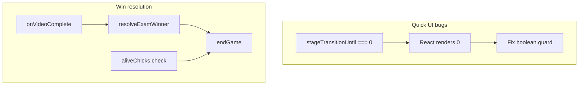

# Fixes and polish (Host / Client / game logic)

## Root cause: “0” on top-left of /Client

In `[src/pages/Client.tsx](src/pages/Client.tsx)`, the client stage overlay uses:

```tsx
{gameState?.stageTransitionUntil && gameState.stageTransitionUntil > 0 && clockNow < ... && (
```

When `stageTransitionUntil === 0`, the first clause evaluates to `**0**`, and React renders `**{0}**` as visible text “0” (classic `&&` / numeric falsy bug).

**Fix:** Replace with a boolean predicate, e.g. `(gameState?.stageTransitionUntil ?? 0) > 0 && clockNow < gameState.stageTransitionUntil` (same pattern anywhere else that mixes `&&` with possibly-zero numbers).

Also make the transition notification the first stage.

---

## Rejoin code without room code

- **Current:** `[handleJoin](src/pages/Client.tsx)` requires `code.length >= 4` and passes `connect(roomCode, rejoinCode)`.
- **Desired:** show room code at the host screen, but keep room code not automatically discoverable in join game page(existing). add last room code memory.

**Approach:**

1. **Join UX:** Enable CONNECT when `rejoinCode.length >= 5` to match generated codes and  **or** `code.length >= 6`. 
2. **Host / signaling:** Today the client connects to `PEER_PREFIX + roomCode` or Supabase channel `game-room-${code}`. For **rejoin-only**, you need one of:
  - **Preferred:** store **last room code** in `localStorage` on successful connect and default the room input when reconnecting; user enters rejoin code only (minimal server change), or

Recommend **localStorage `lastRoomCode`** + optional rejoin-only flow: if `rejoinCode` set and `code` empty, use `lastRoomCode` from storage to open the same room, then send takeover metadata as today.

---

## Eagle takeover: correct color + eagle remote UI

After takeover, `[takeover-accepted](src/pages/Client.tsx)` sets `connIdRef` and host sends `colorIndex`, but `**myAssignment**` (role + chick color from `game-start`) can stay stale, so UI may show the **old** 1v3 pick instead of **eagle** slot.

**Fix:** On `takeover-accepted` **or** next `game-state`, resolve the local player from `gameState.players[connId]` (or match by `colorIndex`) and **rebuild `myAssignment`** (`isEagle`, `chickColor`) from serialized state. Ensure eagle layout branch uses `myState.isEagle` / assignment consistently.

---

## Mystery box events: mobile countdown wrong

Audit all event UIs that derive time from `**endAt**`:

- **Client:** Prefer one clock source (`[clockNow](src/pages/Client.tsx)` interval) for **all** `timeLeft` math (mock, hitbox, crossy already mix `clockNow` vs local `now` in `[CrossyRoadClient](src/components/events/CrossyRoadClient.tsx)` — align crossy to `clockNow` passed in or a shared hook).
- **Host `[EventOverlay](src/pages/Host.tsx)`:** Uses `const now = Date.now()` once per render; host re-renders when snapshot updates, but if updates are sparse, timer can jump. Add `useState` + `setInterval` for `now` inside `EventOverlay` (or read `endAt` from props and tick locally every 100ms).

---

## Mock exam: end early when all chicks have submitted

Server only advances mock exam on timer (`[useGameLogic.ts](src/hooks/useGameLogic.ts)` active event branch). “Submitted” on client is local until a correct `event-answer` sets `chickClicks`, or wrong/no answer at end.

**Approach:**

- Add `**mockExamSubmitted: Record<connId, true>`** (or reuse a dedicated flag) on `GameEvent`, set on **any** `event-answer` while active.
- In the game loop, when **all alive chicks** have an entry in `mockExamSubmitted`, set `ev.endAt = now` (or transition to result immediately) so the phase ends and results run without waiting.

---

## Exam tips: 5s copying + visible countdown

- Replace **3000** with **5000** everywhere for tip-copy timing in `[Client.tsx](src/pages/Client.tsx)` (`tipCopyStartedAt + 3000`, `setTimeout(..., 3000)`), and keep `**tip-copy-notify`** + TipsBox countdown in sync.
- If countdown still invisible: ensure `TipsBox` receives `tipCopyingCountdown` when `loadingTip` is true and verify `clockNow` ticks during that phase (same `&&`/0 render issues as above). The click on tips rectangular box should be disabled during any count down and display the countdown info.

---

## Host stage transition toast (push from left, under zoom, 10s dismiss)

**Current:** `[StageTransition](src/components/StageTransition.tsx)` is `absolute top-10 right-3`, slides from **right**. `[Host.tsx](src/pages/Host.tsx)` places game time at `top-2 left-2` and zoom panel at `left-2 top-12` (w-44).

**Changes:**

1. Position toast under the zoom box: e.g. `left-2` and `top` below zoom (`~top-36` or `top-40` depending on layout), `max-w` similar to zoom panel.
2. Slide from **left:** initial `translateX(-110%)`, animate to `translateX(0)`.
3. **10s dismiss:** Stabilize `onDismiss` with `useCallback` in parent `[Host.tsx](src/pages/Host.tsx)` so `[StageTransition](src/components/StageTransition.tsx)` effect does not churn on every snapshot tick; optionally remove `onDismiss` from deps and use `onDismissRef` to avoid interval resets.

---

## Win condition / transcript / MVP / ceremony

Observed transcript: all **LOSE** despite multiple chicks alive with non-F grades — so `snapshot.winner` was **not** `chicks` (likely `eagle`).

**Audit (priority):**

1. Trace every `[endGame](src/hooks/useGameLogic.ts)` / `[resolveExamWinner](src/hooks/useGameLogic.ts)` call after exam completion and **video** `[onVideoComplete](src/hooks/useGameLogic.ts)` (ensure `pendingExamEndAfterVideo` path always resolves winner once; ensure no second `endGame('eagle')` from `aliveChicks.length === 0` when chicks are still alive).
2. Align **design** with your rule: **“≥1 chick not F ⇒ chicks win”** vs current **count-based** rule (`C >= 2` for 1v3, `C >= 3` for 2v6). If the intended rule is **grade-based (not F)**, change `resolveExamWinner` to count chicks with `!isDead(health)` and optionally treat “F” explicitly via `gradeToLetter` / `isDead`.
3. `[GameOverCeremony](src/pages/Host.tsx)` **MVP** already picks top score on **winning team**; if `winner` is wrong, MVP follows. Fix winner first.
4. **Transcript row** `isWin`: today `winner === 'draw'` shows DRAW in the Result column; for **winning chicks**, ensure `winner === 'chicks'` and per-row `isWin` includes `(winner === 'chicks' && !p.isEagle)`. If any edge case still shows LOSE for chicks, fix `winner` source, not only UI.

---

## Transcript: draw must never show LOSE

Already guarded by `winner === 'draw' ? DRAW : ...` in `[Host.tsx](src/pages/Host.tsx)` transcript table. If users still see LOSE on draw, `**winner` is not `'draw'`** — fix resolution logic, not only labels.

---

## Play Again: navigate to `/` like LEAVE

Replace `window.location.reload()` on transcript **Play Again** with `[useNavigate](https://reactrouter.com/)` `navigate('/')` (and optionally reset host state if you need a clean host session — may require a small refetch or `window.location.href = '/'` if host state is sticky).

---

## Final exam: host layer display rules

**Regression:** `[Host.tsx](src/pages/Host.tsx)` currently shows **layer 1** always during `phase === 'exam'`. You want:

- **Do not** show layer 1 on host while **layer 1 holder is alive** (projector should not spoil the reveal).
- **Edge case:** If **all layer-2 holders are dead** and only **one layer-1** player remains, host should show **layer 2** so they can finish (solo path already assigns layer 2 to device in `[startExam](src/hooks/useGameLogic.ts)` when `soloExam`; extend logic when **multiplayer** but only layer-1 player alive: set `examState.hostShowsLayer` / `examState.layer1Dead` / new flag and host overlay `PW_Final_*_layer-2.png`).

**Implementation sketch:** In `startExam` or on death handlers, compute `hostDisplay: 'none' | '1' | '2'` from `layer1ConnId`, `layer2ConnIds`, and alive set; snapshot includes it; Host renders accordingly.

---

## Crossy Road (Lovable plan vs repo)

`[src/lib/gameTypes.ts](src/lib/gameTypes.ts)`, `[useGameLogic.ts](src/hooks/useGameLogic.ts)` (event type, lanes, messages), `[CrossyRoadClient](src/components/events/CrossyRoadClient.tsx)`, `[CrossyRoadHost](src/components/events/CrossyRoadHost.tsx)`, and preview routes in `[App.tsx](src/App.tsx)` already implement the minigame. The [.lovable/plan.md](.lovable/plan.md) is largely accurate; remaining work is **playtesting and tuning** (timers, mobile parity, balance), not greenfield implementation.

---

## Suggestions for smoother play (design / UX)

1. **Single source of truth for time:** One `now` tick per client frame (already partly `clockNow`); avoid mixing `Date.now()` in JSX for countdowns.
2. **Reduce full-screen takeovers:** Client stage transition is still full-screen (`[Client.tsx](src/pages/Client.tsx)` ~1262) — consider matching host toast or a lighter banner to avoid blocking scanner/joystick.
3. **Rejoin flow:** Persist room code + show clear copy: “Paste rejoin code from host; room code optional if remembered.”
4. **Exam host layers:** Centralize rules in a small table (who sees what, who sees host projector) to avoid regressions.
5. **Endgame clarity:** After fixing `winner`, add a one-line debug log (dev-only) or host-only banner: `Winner: chicks | eagle | draw` before ceremony to catch mismatches quickly.




