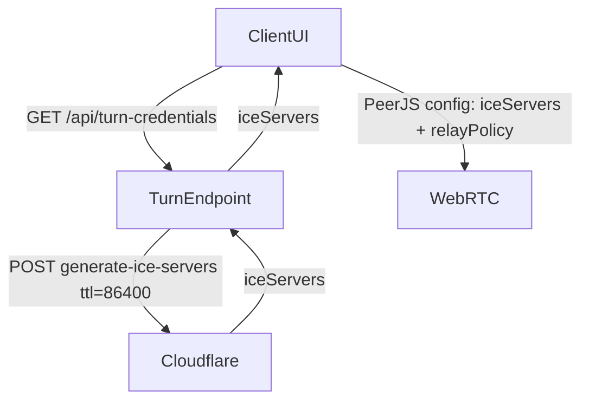

## Goal

- Ensure **immersive mode** uses **WebRTC with Cloudflare TURN** end-to-end (no Supabase option, no rejoin-code UI), and does so smoothly on iOS.
- Keep **non-immersive mode** behavior: user can toggle **WebRTC vs Supabase**.
- Remove the duplicated room-code display box shown after typing 6 characters.

## Key observations (current code)

- Client connection mode is controlled by `mode` in `[src/pages/Client.tsx](c:/Users/mongk/Desktop/firechick/src/pages/Client.tsx)` and passed to `useClientRoom(code, mode)`.
- Host connection mode is controlled by `mode` in `[src/pages/Host.tsx](c:/Users/mongk/Desktop/firechick/src/pages/Host.tsx)` and passed to `useHostRoom(mode)`.
- Immersive state is provided by `[src/context/ImmersiveContext.tsx](c:/Users/mongk/Desktop/firechick/src/context/ImmersiveContext.tsx)` via `useImmersive()`.
- The duplicated room-code display is this block in the client join screen:

```1031:1041:src/pages/Client.tsx
          {code.length >= 6 && (
            <div
              className={`text-center text-lg font-pixel tracking-wider py-2 px-3 rounded border-2 ${
                mode === "webrtc"
                  ? "border-primary text-primary bg-primary/5"
                  : "border-secondary text-secondary bg-secondary/5"
              }`}
            >
              {code}
            </div>
          )}
```

## Desired behavior changes

- **Immersive client join screen**:
  - Show only: `JOIN_GAME` title → room code input → connect button → active rooms list.
  - Hide:
    - WebRTC/Supabase toggle
    - “Reconnect with code” disclosure + input
    - Any duplicated room-code echo box
  - Hard-lock connection to **WebRTC + Cloudflare TURN**.
- **Immersive host lobby**:
  - Hide the connection-mode `<Select>`.
  - Hard-lock host to **WebRTC + Cloudflare TURN**.
- **TURN-only relay in immersive mode**:
  - In immersive mode, configure Peer/WebRTC to **force TURN relay** (equivalent to `iceTransportPolicy: 'relay'`).

## Implementation plan

1. **Plumb an “immersive WebRTC options” flag into the WebRTC creation path**
  - Update `[src/hooks/useGameRoom.ts](c:/Users/mongk/Desktop/firechick/src/hooks/useGameRoom.ts)` public APIs to accept an optional options object, e.g.
    - `useHostRoom(mode, { forceRelay?: boolean })`
    - `useClientRoom(roomCode, mode, { forceRelay?: boolean })`
  - Thread `forceRelay` into the PeerJS config used when creating the peer:
    - Host path: `new Peer(..., { config: { iceServers, iceCandidatePoolSize: 4, iceTransportPolicy: 'relay' }})` when `forceRelay`.
    - Client path: same.
  - Keep this **only** for immersive mode (non-immersive continues default behavior).
2. **Hard-lock immersive mode to WebRTC at the page level**
  - In `[src/pages/Client.tsx](c:/Users/mongk/Desktop/firechick/src/pages/Client.tsx)`:
    - Read immersive state: `const { isImmersive } = useImmersive()`.
    - Compute `effectiveMode = isImmersive ? 'webrtc' : mode`.
    - Use `effectiveMode` for:
      - `useClientRoom(code, effectiveMode, { forceRelay: isImmersive })`
      - `useDiscoverRooms(effectiveMode)` (so immersive always shows WebRTC rooms)
    - Add a small effect to normalize state when entering immersive:
      - If `isImmersive` and `mode !== 'webrtc'`, call `setMode('webrtc')` (prevents UI/state drift).
  - In `[src/pages/Host.tsx](c:/Users/mongk/Desktop/firechick/src/pages/Host.tsx)`:
    - Read immersive state already present: `const { isImmersive } = useImmersive()`.
    - Compute `effectiveMode = isImmersive ? 'webrtc' : mode`.
    - Use `effectiveMode` for:
      - `useHostRoom(effectiveMode, { forceRelay: isImmersive })`
      - `useGameLogic({ ..., connectionMode: effectiveMode, ... })`
3. **Update immersive UI rendering rules**
  - In `Client.tsx` join screen (`if (!connected) { ... }`):
    - **Remove** the duplicated room-code echo block shown when `code.length >= 6`.
    - Conditionally render controls:
      - `if (!isImmersive)`: show rejoin-code section + WebRTC/Supabase switch.
      - `if (isImmersive)`: omit both.
    - Keep the “ACTIVE ROOMS” section visible in immersive (per requirement).
  - In `Host.tsx` lobby UI (`if (phase === 'lobby') { ... }`):
    - Wrap the connection-mode `<Select value={mode} ...>` in `if (!isImmersive)`.
    - Ensure any mode-changing handlers are no-ops / not referenced when immersive.
4. **Runtime-safety checks (avoid leaks/errors)**
  - In `useGameRoom.ts`, ensure:
    - Any async TURN fetch or async peer init respects a cancellation flag (cleanup on unmount).
    - No intervals/timeouts are left running after cleanup.
    - If TURN endpoint fails, the code continues with STUN-only servers (but immersive still forces relay; in that case we should detect “no TURN returned” and fall back from `relay` to default to avoid breaking all connectivity).
      - Proposed rule: **only set `iceTransportPolicy: 'relay'` when TURN iceServers are non-empty**.
5. **Compilation sanity (no full test suite required, will do manually)**
  - Run `npm run build` (or `npm run lint`) to catch TypeScript/ES build errors.
  - Manually verify in browser:
    - Immersive client: no toggle, no rejoin section, no duplicated code display, connect works.
    - Immersive host: no mode select, clients connect.
    - Non-immersive: toggles still function.

## Data-flow diagram




