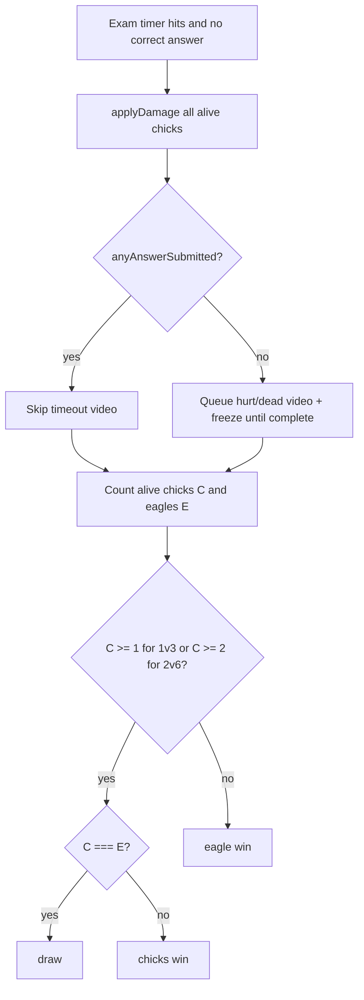

# Fire Chick — repair plan (chat + implementation guide)

## What was wrong (root causes)

### 1) Final exam timer branch does not match your rules

Current logic in `[src/hooks/useGameLogic.ts](src/hooks/useGameLogic.ts)` (exam timer, ~592–610) picks winner from **alive chick count only**, with fixed thresholds (`1v3`: ≥2 chicks win, 1 chick draw; `2v6`: ≥3 win, ≥1 draw). It does **not**:

- Apply `**applyDamage`** (same as a valid eagle hit: −2 letter steps via `[applyDamage](src/lib/gradeSystem.ts)`) to all alive chicks on timeout
- Compare **alive chicks vs alive eagles** for draw
- Play **hurt/dead video** only when **no one submitted** an exam answer before timeout
- Defer `endGame` until after video when a video is queued (similar to attack flow’s `videoPlaying` + `onVideoComplete`)

Your intended resolution order (paraphrased):

1. If time runs out with **no correct answer** (`!examState.answered`): penalize all alive chicks with `applyDamage`; run eliminations / layer-1 side effects as needed.
2. **Video**: play `hurt` or `dead` (more serious among affected chicks) **only if nobody submitted any exam answer** — requires a new flag, e.g. `examState.anyAnswerSubmitted`, set to `true` on first `answer-submit` message (wrong or right).
3. **Winner** (after deaths): let `C =` alive chicks, `E =` alive eagles.
  - If `**(1v3 && C >= 1) || (2v6 && C >= 2)`** then: if `**C === E`** → `**draw`**; else → `**chicks**`.  
  - Otherwise → `**eagle**`.
4. If a timeout video is shown, **delay `endGame`** until `[onVideoComplete](src/hooks/useGameLogic.ts)` (mirror `pendingEagleFreezeAfterVideo` pattern) so grading + eliminations are settled first, then broadcast winner.

### 2) Hurt/Dead video “under” name tags / prop labels (Host)

`[VideoOverlay](src/components/VideoOverlay.tsx)` portals to `document.body` with `z-index: 99999`, but `[@react-three/drei` `Html](src/components/GameplayMap.tsx)` (name tags + prop labels) uses a **very high default z-index range** (commonly on the order of **1e7**), which can sit **above** `99999`.  

**Fix:** raise the overlay above drei Html (e.g. `z-index: 2147483647` or `z-index: 20000000` + confirm in devtools), and optionally pass `zIndexRange` on `Html` in `[GameplayMap.tsx](src/components/GameplayMap.tsx)` to keep in-game tags below full-screen overlays (defensive).

### 3) Props + thumbstick layout (chick remote)

`[Client.tsx](src/pages/Client.tsx)` currently stacks: scanner → two tip boxes → **centered** thumbstick (`flex-1`) → **centered** `PropsStackBtn` at the bottom (lines ~1248–1318). Your spec wants: **props vertical stack to the left**, under the **left** tip box edge; **thumbstick** shifted **right** using remaining width, vertically centered — without changing **eagle** layout.

**Fix:** replace the middle+bottom block for chicks with a **horizontal flex row**: left column (fixed width ~ thumbstick area) = vertical prop stack aligned under left tip box; right column = thumbstick centered in remaining width. Keep eagle section unchanged.

### 4) 2v6 “7th player room full” + “no bad eagle colors”

- **Room full at 6 players** while host is still in `**1v3`**: `[allocateColor](src/hooks/useGameRoom.ts)` excludes `EAGLE_COLOR_INDICES` (`[0,1]`), leaving **only 6** assignable colors. The 7th connection gets `null` → `room-full`. **2v6** uses `excludeIndices = []` → **8** colors.  
**Mitigation in product:** host must switch to **2v6** before filling lobby; optionally add **connection-time guard** using `MAX_PLAYERS_1V3` / `MAX_PLAYERS_2V6` + current mode to send a clearer message (e.g. “room is 1v3 — max 6 colors” vs “room full”).
- **“Bad” colors hard to see** in `[ColorPicker.tsx](src/components/ColorPicker.tsx)`: **Black** (`0 0% 20%`) on dark UI is low-contrast; Gold is fine but easy to miss. **Fix:** for eagle indices, use a brighter ring + label (not only red border), e.g. forced light outline or “EAGLE” text; ensure top row = first 4 colors, bottom = last 4 (already split by `half = ceil(n/2)`).

### 5) Transcript “Result” vs “Draw” / perceived bugs

In `[Host.tsx](src/pages/Host.tsx)` `GameOverCeremony`, when `winner === 'draw'`, `isWin` is true for **everyone** (`|| winner === 'draw'`). That can look wrong if you expect **neutral** rows. After fixing `**winner`**, revisit: for draws, show **DRAW** (or **—**) in Result instead of treating all as WIN.

### 6) Client LEAVE after game over → you want “join” not home

Current game-over LEAVE calls `disconnect()` only (`[Client.tsx](src/pages/Client.tsx)` ~901); that should land on the **JOIN** branch (`!connected`, ~685+). If you still see navigation to `/`, check for **fullscreen gate** (`fsSupported && !isFullscreen && !fsSplashDone`) re-showing the splash before join, or add `navigate('/client')` + state reset intentionally. **Plan:** after disconnect from game over, **force `connected` false** and ensure **join UI** (not `/`) — e.g. `navigate('/client', { replace: true })` if the app is ever mounted elsewhere, or reset `fsSplashDone` only when appropriate.

---

## Files to touch (focused)

| Area                                    | File(s)                                                                                                                                                    |
| --------------------------------------- | ---------------------------------------------------------------------------------------------------------------------------------------------------------- |
| Exam timeout + flags + deferred endGame | `[src/hooks/useGameLogic.ts](src/hooks/useGameLogic.ts)`, possibly `[src/lib/gameTypes.ts](src/lib/gameTypes.ts)` for `examState` fields                   |
| Video z-index                           | `[src/components/VideoOverlay.tsx](src/components/VideoOverlay.tsx)`, optionally `[src/components/GameplayMap.tsx](src/components/GameplayMap.tsx)` `Html` |
| Chick layout                            | `[src/pages/Client.tsx](src/pages/Client.tsx)`                                                                                                             |
| 2v6 colors / lobby clarity              | `[src/components/ColorPicker.tsx](src/components/ColorPicker.tsx)`, `[src/hooks/useGameRoom.ts](src/hooks/useGameRoom.ts)` (clearer `room-full` reason)    |
| Transcript labels                       | `[src/pages/Host.tsx](src/pages/Host.tsx)`                                                                                                                 |

---

## Suggested implementation order

1. **Exam timeout + winner + video gating** — fixes the core “Draw / chicks should win” mismatch and aligns with your penalty rules.
2. **VideoOverlay z-index** — quick visual fix on Host.
3. **Client chick props + thumbstick layout** — UX pass matching your sketch.
4. **2v6 lobby** — clearer eagle colors + optional better `room-full` messaging when 1v3 exhausts 6 colors.
5. **Polish** — transcript Result column for draws; leave-button flow verification.

---

## One follow-up to confirm when coding

- **“No one submitting”** for timeout video: you described **no submission at all**. The implementation will use `anyAnswerSubmitted` on **any** `answer-submit`. If you instead want video only when **no correct answer** but **wrong answers were tried**, say so and flip the condition to `!answered && !anyWrongSubmit` (or similar).

