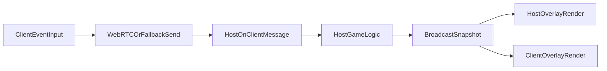

# Game Timing and Event Fix Plan

## Scope
Address the remaining bug fixes and tuning items across countdown authority, mini-game input transport, SUS idle detection, and mock-exam scoring/completion. Keep all gameplay authority on host logic and broadcast deterministic state to clients.

## Targeted Changes
- **Host-authoritative pre-start mock-exam countdown**
  - Update event state in [`/media/sf_AdrianUbuntuShared/firechick/src/hooks/useGameLogic.ts`](/media/sf_AdrianUbuntuShared/firechick/src/hooks/useGameLogic.ts) to publish a host-computed remaining countdown value (or explicit countdown tick) for `activeEvent.phase === "countdown"`.
  - Replace local `Date.now() - startedAt` countdown rendering in [`/media/sf_AdrianUbuntuShared/firechick/src/pages/Client.tsx`](/media/sf_AdrianUbuntuShared/firechick/src/pages/Client.tsx) with host-provided remaining time.
  - Align host overlay countdown in [`/media/sf_AdrianUbuntuShared/firechick/src/pages/Host.tsx`](/media/sf_AdrianUbuntuShared/firechick/src/pages/Host.tsx) to the same host-derived remaining value for consistent visuals.

- **Mini-game input delivery reliability (Hitbox + Crossy Road)**
  - Ensure event input allowlist includes batched hitbox payloads in [`/media/sf_AdrianUbuntuShared/firechick/src/hooks/useGameRoom.ts`](/media/sf_AdrianUbuntuShared/firechick/src/hooks/useGameRoom.ts) (currently `event-hitbox-batch` is missing while host expects it).
  - Add guarded diagnostics around `sendToHost` and host receipt path to confirm message lifecycle:
    - client send path in [`/media/sf_AdrianUbuntuShared/firechick/src/pages/Client.tsx`](/media/sf_AdrianUbuntuShared/firechick/src/pages/Client.tsx)
    - host receive/dispatch in [`/media/sf_AdrianUbuntuShared/firechick/src/pages/Host.tsx`](/media/sf_AdrianUbuntuShared/firechick/src/pages/Host.tsx) and [`/media/sf_AdrianUbuntuShared/firechick/src/hooks/useGameLogic.ts`](/media/sf_AdrianUbuntuShared/firechick/src/hooks/useGameLogic.ts)
  - Verify Crossy control events (`crossy-hop`, `crossy-eagle-action`) are not blocked by phase/input locks during active event windows.
  - Keep existing UI components and only repair functional signaling.

- **Pause SUS idle enforcement during mini-games**
  - In SUS detection branch of [`/media/sf_AdrianUbuntuShared/firechick/src/hooks/useGameLogic.ts`](/media/sf_AdrianUbuntuShared/firechick/src/hooks/useGameLogic.ts), explicitly suspend inactivity-triggered SUS warnings/timers while an in-game mini-game is active (`mock-exam`, `crossy-road`, `hitbox`).
  - Prevent timer accumulation during event phases so players are not flagged/replaced due to non-movement while participating in event UI.

- **Mock-exam completion and individual scoring refinement**
  - Adjust early-end submission condition in [`/media/sf_AdrianUbuntuShared/firechick/src/hooks/useGameLogic.ts`](/media/sf_AdrianUbuntuShared/firechick/src/hooks/useGameLogic.ts) so event ends when all eligible non-bot, non-eagle participants submit.
  - Exclude bots from completion majority logic and all-finished checks.
  - Convert scoring from team-level outcome to per-player outcome:
    - reward only correct respondents
    - deduct only incorrect/unanswered eligible players
    - keep bots excluded from participant scoring.
  - Reuse final-exam participant filtering style where appropriate for consistency.

## Validation Plan
- Manual host/client multi-session checks:
  - Mock-exam countdown displays same step on all clients and host.
  - Hitbox taps and Crossy actions produce host-side state changes immediately.
  - SUS warning does not appear during mini-game phases.
  - Mock exam ends immediately after last eligible non-bot player submits.
  - Score updates are per-player (correct rewarded, incorrect/unanswered deducted), with bots excluded.
- Run project lint/typecheck for touched files and resolve any introduced diagnostics.

## Data-Flow Alignment

This keeps host as the single authority for timers, event state, and scoring while clients act as input/render endpoints.