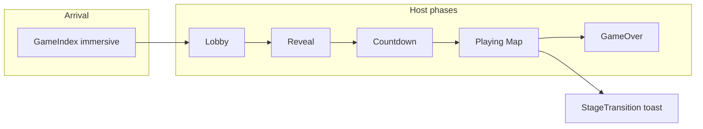

# Immersive exhibition mode — gap analysis and implementation plan

## What is already done (vs. plan)

| Plan section                             | Status                                                                                                                                                                                                                                                                                                                                                                  |
| ---------------------------------------- | ----------------------------------------------------------------------------------------------------------------------------------------------------------------------------------------------------------------------------------------------------------------------------------------------------------------------------------------------------------------------- |
| 1–2 Immersive toggle + cinematic arrival | **Done** — `[ImmersiveContext.tsx](c:/Users/mongk/Desktop/firechick/src/context/ImmersiveContext.tsx)` (incl. `localStorage`), `[GameIndex.tsx](c:/Users/mongk/Desktop/firechick/src/pages/GameIndex.tsx)` (`GO IMMERSIVE` / `IMMERSIVE ON`, particles, scanlines, vignette, title, watermark), `[index.css](c:/Users/mongk/Desktop/firechick/src/index.css)` keyframes |
| 5 Game-over ceremony                     | **Partially done** — `[Host.tsx](c:/Users/mongk/Desktop/firechick/src/pages/Host.tsx)` `GameOverCeremony` uses `isImmersive` for particles, vignette, spot lights, staggered transcript rows (`ceremony-row-reveal`). Still room for plan items: MVP typewriter name/score, WIN/LOSE stamp motion, scrolling grid behind transcript (CSS-only).                         |
| 3–4 Map atmosphere + phase transitions   | **Not done** — `[GameplayMap.tsx](c:/Users/mongk/Desktop/firechick/src/components/GameplayMap.tsx)` has **no** `isImmersive` / fog / instanced particles / `Edges`. Countdown and reveal in `Host` are still the simple centered layout. `[StageTransition.tsx](c:/Users/mongk/Desktop/firechick/src/components/StageTransition.tsx)` is a small slide-in card only.    |
| 6 Environmental details                  | **Not done** — no host damage glitch, mystery-box aura beyond rotation, footprints, or window flicker                                                                                                                                                                                                                                                                   |

`GameplayMap` is only used from `[Host.tsx](c:/Users/mongk/Desktop/firechick/src/pages/Host.tsx)`, so you can pass `isImmersive` as a prop (keeps R3F tree free of implicit context coupling) or call `useImmersive()` inside the component—prop is slightly clearer for testing.

---

## Design alignment (course ideas → concrete UI)

These map to implementation choices rather than on-screen copy:

- **Black box / cinema logic**: Full-bleed **countdown** (one giant numeral, keyed scale/fade per tick), **reveal** opening from black with a short beat, stage change with a **banner** and optional flash—sequencing and attention, not extra text.
- **Spatial distance + emotional read**: `**FogExp2`** + softer horizon / **edge haze** (CSS gradient on the map wrapper) so the board reads as a “volume” the audience looks into; subtle **floating particles** reinforce depth without post-processing.
- **Interfaces as theme**: Treat overlays as **framed surfaces**—immersive **StageTransition** uses `backdrop-blur`, stronger border/light, maybe a slim “signal” progress line; host **exam layer** could get a matching frame when `isImmersive` (optional polish).
- **Environmental storytelling**: Building `**Edges`** (drei), optional **emissive window quads** on building faces with slow random flicker, **mystery box** ring of small instanced meshes; **damage glitch** on the host play view links system state to a visceral “interface hiccup.”
- **~1 min attention**: Keep immersive extras **readable at a glance**—one primary motion per beat (countdown number OR banner, not both fighting for focus).

---

## Implementation plan (code)

### 1. Wire `isImmersive` into the map

- In `[Host.tsx](c:/Users/mongk/Desktop/firechick/src/pages/Host.tsx)`, pass `isImmersive` into `<GameplayMap ... />` (read `useImmersive()` once near other host state if not already in scope for that branch).
- In `[GameplayMap.tsx](c:/Users/mongk/Desktop/firechick/src/components/GameplayMap.tsx)`:
  - Add optional prop `immersive?: boolean`.
  - When true: set scene `**fog**` (`FogExp2`, color derived from existing `themeHue` / teal-blue family), replace or augment `DayLighting` with a **slow-rotating gradient sky** (same back-side sphere pattern, shader or two-tone `meshBasicMaterial` is enough).
  - Add `**InstancedMesh`** (~40–60 soft quads or small spheres) with slow upward drift in `useFrame` (cheap “wow”).
  - Wrap or extend `**Building`** with `**<Edges>`** from `@react-three/drei` when immersive (threshold angle so edges aren’t noisy).
  - `**MysteryBoxMarker`**: extra torus/ring or instanced dots orbiting when active.
  - **Map edge haze**: absolutely positioned div on the **outer** map container in `Host` or inside `GameplayMap`’s wrapper (pointer-events none)—radial gradient to black at edges.
  - `**MeshReflectorMaterial`**: try last; if FPS drops on exhibition hardware, drop it and keep fog + particles only (matches your plan’s performance note).

### 2. Cinematic countdown and reveal (`[Host.tsx](c:/Users/mongk/Desktop/firechick/src/pages/Host.tsx)`)

- For `phase === "countdown"` and `phase === "reveal"`, branch on `isImmersive`:
  - Black full-screen base, `immersive-vignette`, optional light scanline (reuse class from index.css at low opacity).
  - Countdown: number with **CSS keyframe** `scale(3) → scale(1)` + opacity keyed to `Math.ceil(count)` (reset animation via `key={count}`).
  - Optional **edge pulses**: thin `fixed` left/right borders with team-tinted opacity animation (green/purple from CSS variables).
  - Reveal: copy the cinematic language from countdown (same container) so the flow feels authored, not a separate mini-app.

### 3. Stage transition overhaul (`[StageTransition.tsx](c:/Users/mongk/Desktop/firechick/src/components/StageTransition.tsx)`)

- Add prop `immersive?: boolean` (passed from `Host` where `stageToast` renders).
- **Immersive variant**: full-width top or center **banner** slide + `backdrop-blur-md` / `bg-card/40` card, stage title as hero line; keep click-to-dismiss and timer; optional single-frame **flash** on mount (`useEffect` toggling opacity class once) — keep subtle to avoid seizure concerns.

### 4. Host lobby shell (optional but high impact for “host map”)

- In `phase === "lobby"` in `[Host.tsx](c:/Users/mongk/Desktop/firechick/src/pages/Host.tsx)`, when `isImmersive`: black background, vignette, very subtle scanlines (same as arrival), so the **LobbyArena** feels continuous with GameIndex.
- Optionally pass `immersive` into `[LobbyArena.tsx](c:/Users/mongk/Desktop/firechick/src/components/LobbyArena.tsx)` for fog + dimmer fill light only (smaller change set than full gameplay map).

### 5. Damage glitch (playing / exam)

- In the playing-phase parent `div` in `[Host.tsx](c:/Users/mongk/Desktop/firechick/src/pages/Host.tsx)`, `useRef` previous `damageTaken` per player (or sum); on increase, set a short timeout state `hostGlitchUntil` and apply a class (e.g. `host-damage-glitch` in `[index.css](c:/Users/mongk/Desktop/firechick/src/index.css)`) with `transform: translate`, `filter: hue-rotate` / slight blur, 150–250ms.

### 6. Ceremony polish (finish plan §5)

- MVP: typewriter or staggered span for name + score; transcript: optional **scrolling grid** background + **scale bounce** on grade cells when immersive (CSS only).

---

## Testing

- Toggle immersive on GameIndex → Host → start game: verify fog/particles/edges, countdown/reveal, stage toast, no console errors.
- Throttle CPU in DevTools or use a low-power laptop to validate without reflector.
- Run `npm run build` / existing `npm test` if you touch shared types.

