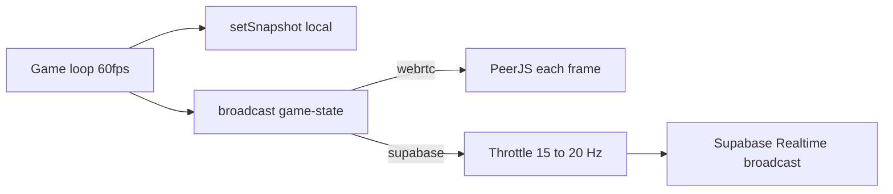

# iOS WebRTC, GLB, fullscreen, and Supabase stability

## Root causes (from codebase review)

### 1. Supabase “stuck phase” / loss of control (primary)

The game loop calls `[doBroadcastState](src/hooks/useGameLogic.ts)` on **every animation frame** (~60fps) during countdown, playing, and exam. Each call sends a **full** `[game-state](src/hooks/useGameLogic.ts)` snapshot via `broadcast({ type: "game-state", state: snap })`.

- **WebRTC path**: PeerJS sends JSON strings per peer; high frequency is heavy but often still works on LAN.
- **Supabase path**: The same `broadcast` funnels into Realtime **broadcast** events. That implies **tens of broadcasts per second per room**, plus joystick traffic. This will hit [Realtime rate/size limits](https://supabase.com/docs/guides/realtime/rate-limits), cause backlog/drops, and matches “everyone stuck / no control” when updates stop applying.

**Fix**: Pass `[ConnectionMode](src/hooks/useGameRoom.ts)` into `[useGameLogic](src/hooks/useGameLogic.ts)` (from `[Host.tsx](src/pages/Host.tsx)` where `mode` already exists). In `doBroadcastState`:

- Always update **local** React state with `setSnapshot(snap)` every frame so the host screen stays smooth.
- **Network**: When `mode === 'supabase'`, **throttle** outbound `game-state` broadcasts (e.g. **15–20 Hz**, ~50–66ms min interval). Event-driven messages (`phase-change`, `you-died`, `tip-qr`, `game-over`, etc.) stay **immediate** (they use separate `broadcast` calls, not `doBroadcastState` only — verify any that only flow through `doBroadcastState`).

If snapshots feel choppy on clients at 20Hz, optional follow-up is client-side interpolation; first ship throttle + correctness.

### 2. Supabase identity bugs (secondary but real)

`[useHostSupabase](src/hooks/useGameRoom.ts)` maintains `clientAliasRef` (new client id → original slot id) after takeover. **Some handlers resolve this; others do not:**

| Event           | Resolves alias?                                                         |
| --------------- | ----------------------------------------------------------------------- |
| `joystick`      | Yes                                                                     |
| `client-action` | Yes                                                                     |
| `pong`          | **No** — uses raw `clientId` for `Map` lookup                           |
| `client-leave`  | **No** — `removePlayer(clientId)` may not match slot key after takeover |
| `color-swap`    | **No** — `handleColorSwap(clientId, …)` may not find the player         |

**Fix**: Introduce a small helper `resolveClientId(id) => clientAliasRef.current.get(id) ?? id` (or inline equivalent) and use it in `**pong`**, `**client-leave`** (and cleanup of alias maps), and `**color-swap**` before touching `clientColorMapRef` / `players`.

### 3. WebRTC on iPhone (PeerJS + ICE)

Current client connection in `[useClientWebRTC](src/hooks/useGameRoom.ts)`:

- Uses `serialization: 'binary'` and `reliable: false` for the data channel.
- ICE is **STUN-only** (Google public STUN). Cellular / strict NAT often **requires TURN**; iPhones on LTE are a classic case.

**Fixes**:

1. **ICE servers**: Add optional `VITE_ICE_SERVERS` (JSON array) or separate `VITE_TURN_*` vars in `[.env](.env)` / build docs, and merge with STUN in both `new Peer(...)` configs (host + client). Users must supply a TURN provider (Twilio, Metered, Cloudflare, self-hosted coturn) for reliable iPhone↔host paths.
2. **Serialization**: Switch PeerJS data channel to `**serialization: 'json'`** (or send JSON strings) for joystick + messages. Implement host `conn.on('data')` to accept **either** legacy `ArrayBuffer` (decode as today) **or** a small JSON object `{ type: 'joystick', colorIndex, x, y }` for one migration path. This avoids iOS quirks with binary packing on data channels.
3. **Pings**: Today the client **does not** respond to `ping` when `idleRef` is true (`[useClientWebRTC](src/hooks/useGameRoom.ts)` ~733–736). Prefer **always** sending `pong` so the host does not mis-attribute connection health (minor but easy).

### 4. GLB / WebGL black screen on iOS (Character reveal + lobby)

Likely contributors:

- **Multiple WebGL contexts** (e.g. `[LobbyArena](src/components/LobbyArena.tsx)` + `[CharacterReveal](src/components/CharacterReveal.tsx)` + `[CharacterViewer](src/components/CharacterViewer.tsx)`) and large GLBs → memory pressure / context loss on iPhone.
- Default R3F `[Canvas](src/components/CharacterReveal.tsx)` settings may need safer `gl` options on iOS.

**Fixes** (incremental):

1. `[CharacterReveal.tsx](src/components/CharacterReveal.tsx)` (and optionally `[LobbyArena.tsx](src/components/LobbyArena.tsx)` / `[Character.tsx](src/pages/Character.tsx)`): pass `gl` props such as `antialias: false`, `powerPreference: 'default'`, `preserveDrawingBuffer: false` (or try `true` if testing shows compositing issues), and cap `dpr` on mobile (e.g. `dpr={[1, 1.5]}` or `Math.min(window.devicePixelRatio, 1.5)`).
2. Add `onCreated={({ gl }) => { gl.domElement.addEventListener('webglcontextlost', ...) }}` with a simple recovery or fallback UI (e.g. “3D unavailable — tap to retry” / show static color card).
3. If lobby + reveal still OOM: **unmount** lobby canvas before mounting character reveal (route/phase gate) or reduce simultaneous `CharacterViewer` instances.

### 5. Fullscreen on iPhone

`[useFullscreen](src/hooks/useFullscreen.ts)` sets `isSupported` from `documentElement.requestFullscreen` / `webkitRequestFullscreen`. On many iOS versions, **document fullscreen is missing or ineffective**; UI gates like `fsSupported && !isFullscreen` in `[GameIndex.tsx](src/pages/GameIndex.tsx)` and `[Client.tsx](src/pages/Client.tsx)` **hide** the fullscreen control entirely when unsupported — matching “button not visible.”

**Fixes**:

1. Split concepts: `**canNativeFullscreen`** vs `**showImmersiveControl`**. Always show an **“Expand / hide browser UI”** control on touch devices when native fullscreen is not available, using best-effort tricks: `window.scrollTo(0, 1)`, `100dvh` / `visualViewport` resize handling, and short helper copy (“On iOS: Share → Add to Home Screen” optional).
2. On **Join** (`handleJoin` in `[Client.tsx](src/pages/Client.tsx)`), call `enterFullscreen()` in the **same user gesture** as `connect(...)` so Safari allows fullscreen when the API exists.
3. Keep the pre-join splash for native fullscreen where supported; for iOS without API, replace with the immersive fallback instead of hiding all UI.

---

## Architecture sketch (Supabase game-state)

---

## Files to touch (expected)

| Area                     | Files                                                                                                                                                                                                       |
| ------------------------ | ----------------------------------------------------------------------------------------------------------------------------------------------------------------------------------------------------------- |
| Supabase throttle + mode | `[src/hooks/useGameLogic.ts](src/hooks/useGameLogic.ts)`, `[src/pages/Host.tsx](src/pages/Host.tsx)`                                                                                                        |
| Supabase alias fixes     | `[src/hooks/useGameRoom.ts](src/hooks/useGameRoom.ts)`                                                                                                                                                      |
| WebRTC iOS               | `[src/hooks/useGameRoom.ts](src/hooks/useGameRoom.ts)`, env example / README snippet (only if you already document env — avoid new markdown unless you want it)                                             |
| GLB / Canvas             | `[src/components/CharacterReveal.tsx](src/components/CharacterReveal.tsx)`, possibly `[src/components/LobbyArena.tsx](src/components/LobbyArena.tsx)`, `[src/pages/Character.tsx](src/pages/Character.tsx)` |
| Fullscreen               | `[src/hooks/useFullscreen.ts](src/hooks/useFullscreen.ts)`, `[src/pages/Client.tsx](src/pages/Client.tsx)`, `[src/pages/GameIndex.tsx](src/pages/GameIndex.tsx)`                                            |

---

## Verification checklist

- **iPhone + WebRTC**: Join room on LTE with TURN configured; joystick and host messages work; no silent binary parse failures.
- **Supabase**: Long playing session without freeze; reconnect/takeover still removes correct slot on leave; ping RTT updates after takeover.
- **GLB**: Transition lobby → character reveal without black screen on a low-memory iPhone (best effort).
- **Fullscreen**: iOS users always see an expand/immersive affordance; native fullscreen still works where supported; join attempts fullscreen in same tap when supported.

