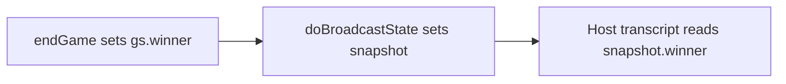

# Mobile Eagle controls, transcript, and Lovable plan verification

## 1. Why mobile Eagle buttons show no countdown (root cause)

The live client does **not** use [src/components/controls/EagleControls.tsx](src/components/controls/EagleControls.tsx) for gameplay. It uses inline `**PropsBtn`** in [src/pages/Client.tsx](src/pages/Client.tsx) (lines 43–110).

| Issue                 | Detail                                                                                                                                                                                                                                                                                                                                                                                |
| --------------------- | ------------------------------------------------------------------------------------------------------------------------------------------------------------------------------------------------------------------------------------------------------------------------------------------------------------------------------------------------------------------------------------- |
| **Cage**              | `PropsBtn` only treats **fly** as having a cooldown (`flyOnCooldown` when `current.type === 'fly'`). When the player cycles to **cage**, `cageCooldownUntil` is ignored, so the button stays icon-only while unusable — this matches “sends work but no countdown when disabled.” [EagleControls](src/components/controls/EagleControls.tsx) shows seconds for **both** fly and cage. |
| **Fly ring progress** | `PropsBtn` hardcodes `totalCd = 5000` for the SVG ring, but the server uses `FLY_COOLDOWN = 15000` in [useGameLogic.ts](src/hooks/useGameLogic.ts). The **number** (`flyCdSec`) can be correct while the ring completes in 5s — feels “broken” vs desktop expectations.                                                                                                               |

**Recommended approach (minimal, focused):**

- Extend `PropsBtn` to accept `cageCooldownUntil` (from `myState.cageCooldownUntil`).
- When `isEagle && current.type === 'cage'`, mirror fly: show `Xs`, muted styling, and a progress ring using `**CAGE_COOLDOWN` (60000)** or the same pattern as `EagleControls` (opacity + seconds).
- Drive the **fly** ring from `**FLY_COOLDOWN` (15000)** (import a shared constant from a small `gameplayConstants` export or from `gameplayMapData` / new `src/lib/cooldownConstants.ts` next to existing timing constants) so ring and seconds stay aligned.

Optional stronger parity: render `**EagleControls`** inside `Client.tsx` for the eagle branch instead of duplicating logic — only if you want one source of truth; otherwise extending `PropsBtn` is enough.

**Attack button:** [AttackButton.tsx](src/components/AttackButton.tsx) already shows numeric cooldown when `cooldownUntil > now, but not during the testing`. If something still looks wrong after prop fixes, re-test; the main gap observed in code is **cage + fly ring duration** on `PropsBtn`.

---

## 2. Transcript “Result” column: three outcomes (WIN / LOSE / DRAW)

[GameOverCeremony](src/pages/Host.tsx) table (around 737–773) already branches `winner === 'draw'` before WIN/LOSE. [TranscriptView.tsx](src/components/TranscriptView.tsx) uses the same tri-state pattern (`isDraw` then `isWin`).

The likely bug: `**snapshot.winner` can still be `null` during `phase === 'gameover'`** because `endGame` in [useGameLogic.ts](src/hooks/useGameLogic.ts) sets `gs.winner` and `setPhase('gameover')` but `**setSnapshot` only runs inside `doBroadcastState`**, which is **not** called after every `endGame` (e.g. `answer-submit` success path ~1567, `onVideoComplete` → `resolveExamWinner` ~1624–1627, `endGame` at ~1646).

When `winner` is `null`, the UI falls through to **LOSE for everyone** — often mistaken for “lose on draw.”

**Fix:**

- After **every** `endGame(gs, winner, bcast)`, call `**doBroadcastState(gs, bcast)`** (or a small helper `endGameAndBroadcast(gs, winner, bcast)` that sets winner, phase, cancels RAF, then broadcasts once).
- In the transcript row, add a defensive helper, e.g. `getMatchResult(snapshot.winner, p)` returning `'draw' | 'win' | 'lose'` so rendering is explicitly three-way and **null winner** shows **DRAW** or **—** (prefer one consistent rule; simplest is: **never show LOSE when `winner` is null** once broadcast is fixed).

---

## 3. Lovable plan vs codebase — implemented vs gaps

Aligned with [.lovable/plan.md](.lovable/plan.md) and your notes:

| Item                                                          | Status                                                                                              | Action                                                                                                                                                                                                                                                         |
| ------------------------------------------------------------- | --------------------------------------------------------------------------------------------------- | -------------------------------------------------------------------------------------------------------------------------------------------------------------------------------------------------------------------------------------------------------------- |
| **Tip share radius 6, QR request + scan proximity**           | Largely in [useGameLogic.ts](src/hooks/useGameLogic.ts) (`tip-request`, `scan-result`)              | **Expire active tip shares in the game loop** if the sharer is no longer within `TIP_SHARE_RADIUS` of **any** other alive chick (plan §1). Today `activeTipShares` is only added, not pruned over time (grep shows no delete in tick).                         |
| **Client “Move closer”**                                      | Host sends `tip-reject` ([useGameLogic.ts](src/hooks/useGameLogic.ts) ~1464)                        | `**tip-reject` is not in `HostMessage` and not handled in Client** — add type + handler (toast or inline text near tip buttons).                                                                                                                               |
| **Chick start: 2 speed + 1 teleport**                         | [useGameLogic.ts](src/hooks/useGameLogic.ts) ~273–275                                               | OK                                                                                                                                                                                                                                                             |
| **Teleport two-phase + dot on map**                           | Host sim + [GameplayMap.tsx](src/components/GameplayMap.tsx) `TeleportDot`                          | **Client:** `PropsStackBtn` does not swap teleport icon to **✕** when `myState.teleportPending`; plan expects parity with [PropsButton.tsx](src/components/PropsButton.tsx) / Lovable copy. Pass `teleportPending` into the stack and render `Crosshair` vs ✕. |
| **Eagle cage: cooldown, random chick, 20s detention, invuln** | Server + map cage mesh                                                                              | **Client:** no “DETAINED” overlay / thumbstick note when `myState.cagedUntil > now` (plan §3). Add overlay + optionally block redundant sends (host already blocks movement).                                                                                  |
| **Invincible ripple (bigger, spreading)**                     | [GameplayMap.tsx](src/components/GameplayMap.tsx) `InvincibleRipple3D`                              | Largely done; optional tweak scale/opacity to taste. [Client.tsx](src/pages/Client.tsx) `InvincibleRipple` (CSS) is separate — keep or align with map-only feedback.                                                                                           |
| `**cage-use` message**                                        | In [gameTypes.ts](src/lib/gameTypes.ts), **unused** in [useGameLogic.ts](src/hooks/useGameLogic.ts) | Either remove from types or implement; **eagle already uses `prop-use` + `cage`** — prefer removing dead `cage-use` / `handleCageUse` in Client to avoid confusion.                                                                                            |

**Draw as match outcome:** Types and UI allow `draw`, but `**endGame(..., 'draw')` is never called** in the current `useGameLogic` grep set. If you want real draws (e.g. exam stalemate), that is a separate rules change; the transcript fix above addresses **null winner** and explicit WIN/LOSE/DRAW display.

---

## 4. Files to touch (concise)

- [src/pages/Client.tsx](src/pages/Client.tsx) — `PropsBtn` (cage + fly duration), teleport ✕ in `PropsStackBtn`, optional caged overlay; `tip-reject` handler; remove dead cage-use wiring if unused.
- [src/lib/gameTypes.ts](src/lib/gameTypes.ts) — add `tip-reject` to `HostMessage`; trim stale messages if agreed.
- [src/hooks/useGameLogic.ts](src/hooks/useGameLogic.ts) — `endGame` + `doBroadcastState`; proximity expiry loop for `activeTipShares`.
- [src/pages/Host.tsx](src/pages/Host.tsx) — optional `getMatchResult` helper for transcript clarity (after snapshot fix).
- Constants: share `FLY_COOLDOWN` / `CAGE_COOLDOWN` between logic and UI (avoid magic `5000` / `5000` in `PropsBtn`).

No change to [.lovable/plan.md](.lovable/plan.md) unless you want the doc updated after implementation.