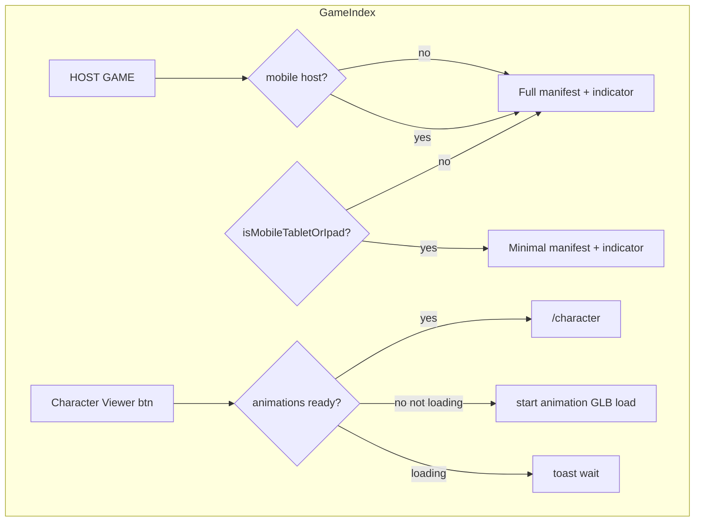

# Selective asset loading and Character Viewer pack

## Current behavior (baseline)

- `[src/components/AssetLoadingIndicator.tsx](src/components/AssetLoadingIndicator.tsx)` builds one flat list: all animation GLBs (Idle/Running/Victory × 8 colors + Attack × 2), 16 PW PNGs, and 2 MP4s; shows spinner + `%` then “Loaded”. Position is `**fixed bottom-3 right-3**` (your message said bottom-left—plan will move the indicator to **bottom-left** to match the new spec).
- `[src/pages/GameIndex.tsx](src/pages/GameIndex.tsx)` always calls `preloadAllAnimations()` on mount (`[src/lib/preloadAssets.ts](src/lib/preloadAssets.ts)`), which `useGLTF.preload`s every animation GLB.
- `[src/lib/assets.ts](src/lib/assets.ts)` already abstracts **local vs Cloudflare** URLs; the same logic must drive every manifest path (no separate “CDN vs local” branches beyond `assetUrl()`).

## 1. Single source of truth for URL lists

Add a small module (e.g. `[src/lib/assetManifests.ts](src/lib/assetManifests.ts)`) that exports:

| Tier                                  | Contents                                                                                                                                                                                                                                                      | Counts (as specified)      |
| ------------------------------------- | ------------------------------------------------------------------------------------------------------------------------------------------------------------------------------------------------------------------------------------------------------------- | -------------------------- |
| **Minimal join (mobile/tablet/iPad)** | `FireChick/FireChick_Models/FireChick_{Color}.glb` for the eight colors already referenced in `[CharacterReveal.tsx](src/components/CharacterReveal.tsx)`                                                                                                     | 8 GLB                      |
|                                       | Same 16 PW PNGs as today (`PW_Final_`* / `PW_Mock_*` for q=1..4)                                                                                                                                                                                              | 16 PNG                     |
| **Full desktop / host-on-mobile**     | Today’s full list from `AssetLoadingIndicator`: minimal join is **not** enough here—add all animation GLBs (same set as `ALL_PATHS` in preload), 16 PW PNGs, `Hurt.mp4`, `Dead.mp4`                                                                           | unchanged total vs current |
| **Character viewer animation pack**   | All GLBs under `FireChick/FireChick_Animation` that the app actually uses: same as `[preloadAssets.ts](src/lib/preloadAssets.ts)` / `CharacterViewer` paths—**no** `FireChick_Walking` (already omitted). Export as `CHARACTER_ANIMATION_GLB_URLS` for reuse. |                            |

Refactor `AssetLoadingIndicator` and `preloadAssets` to import from this manifest so paths cannot drift.

## 2. Device detection

Add a small helper (e.g. `[src/lib/device.ts](src/lib/device.ts)`) exporting `isMobileTabletOrIpad(): boolean` using a practical combination of:

- `matchMedia` for coarse pointer / max-width (covers phones and many tablets), and  
- a conservative `navigator.userAgent` / `userAgentData` check for **iPad** (Safari often reports as desktop).

Use this only for **UX tiers** (which manifest + which buttons), not for security.

## 3. Persistent “site data” (Cache API)

Introduce `[src/lib/assetCache.ts](src/lib/assetCache.ts)` (or similar):

- After a successful `fetch` (or existing `preloadOne` completion), `**caches.open(CACHE_NAME)`** and `cache.put(request, response.clone())` for that URL so DevTools → **Application → Cache Storage** shows the same assets for repeat visits.
- Use a **single cache name** aligned with `[public/asset-cache-sw.js](public/asset-cache-sw.js)` (`firechick-assets-v1`) **or** bump both together if you prefer a new version—keeping names in sync avoids duplicate caches.
- Optional fast path: on startup, `cache.match` each URL in the active tier; if all present, jump progress to 100% and skip network (still call `useGLTF.preload` for GLBs so the Three/drei layer is warm—see below).

**Local vs Cloudflare:** same-origin local URLs and `https://firechick-assets...` URLs both work with `cache.put` when the response is CORS-readable (your SW already assumes CDN CORS). Local `fetch` to same origin is fine.

## 4. Loading hook / context

Add `[src/hooks/useAssetLoadingState.tsx](src/hooks/useAssetLoadingState.tsx)` (or context under `[src/App.tsx](src/App.tsx)`) to hold:

- `minimalReady`, `fullReady`, `characterAnimationsReady`, `characterAnimationsLoading`, progress values (0–100) for each concern.
- Imperative API: `startFullPreload()`, `startCharacterAnimationPreload()` (idempotent; safe if already loading or done).

Implementation details:

- Reuse the concurrency + timeout patterns from `AssetLoadingIndicator` (`FETCH_CONCURRENCY`, `PER_ASSET_TIMEOUT_MS`, `mapPool`).
- After each GLB URL is successfully fetched/cached, call `**useGLTF.preload(url)`** from `@react-three/drei` for that URL so gameplay and `/character` don’t hit the network again (same pattern as today’s `preloadAllAnimations()`).

## 5. `AssetLoadingIndicator` behavior

- **Desktop / non-mobile:** load **full** manifest; show `%` then “Loaded”; position **bottom-left** as requested.
- **Mobile/tablet/iPad (join path):** load **minimal** manifest only; show `%` and a **“Loaded”** (or similar) label when the 24 assets complete; persist via `assetCache`.
- **Do not** call `preloadAllAnimations()` from `[GameIndex.tsx](src/pages/GameIndex.tsx)` on mobile minimal—only after character pack or full tier completes.

## 6. Host game on mobile (special case)

On `[GameIndex.tsx](src/pages/GameIndex.tsx)`, **HOST GAME** `onClick`:

- If `isMobileTabletOrIpad()` → call `startFullPreload()` (full manifest + `useGLTF.preload` for all animation GLBs like desktop). Show a blocking UI state (spinner / disabled button / overlay) until `fullReady`; then `navigate('/host')`.
- If desktop → keep current behavior (preload can stay eager or match full—align with “load everything”).

This matches “treat as non-mobile” for hosting.

## 7. Character Viewer: circular download button + gating

On **GameIndex** only for mobile/tablet/iPad:

- Add a **compact circular control** beside the existing “CHARACTER VIEWER” button:
  - **Idle:** grey ring + **download arrow** (center).
  - **Loading:** **%** text inside the ring (SVG `stroke-dashoffset` or conic gradient).
  - **Complete:** **green** ring + **green check** icon inside.
- `**startCharacterAnimationPreload`** loads **only** `CHARACTER_ANIMATION_GLB_URLS` (all `FireChick_Animation` GLBs except Walking), caches + `useGLTF.preload` each.
- **CHARACTER VIEWER** button:
  - If `characterAnimationsReady` → `navigate('/character')`.
  - If not ready and not loading → **start** the same preload as the circle button (no navigation yet).
  - If loading → `**toast`** (use existing `[src/components/ui/sonner.tsx](src/components/ui/sonner.tsx)` `toast`) e.g. “Please wait for character files to finish loading.”

## 8. `/character` route

Update `[src/pages/Character.tsx](src/pages/Character.tsx)`:

- Remove unconditional `preloadAllAnimations()` on mount for the mobile path **or** gate behind `characterAnimationsReady` from context.
- If user lands on `/character` without the pack (bookmark/direct URL), show the same “download / loading” affordance or auto-start `startCharacterAnimationPreload()` once—avoid a broken viewer.

## 9. Edge note (out of scope unless you want it)

Minimal mobile join **excludes** `Hurt.mp4` / `Dead.mp4`. Those may incur first-use load during gameplay; if that’s unacceptable, add them to the minimal manifest later (would exceed “8+16 only” unless you drop something else).

1. Small wish, I would like the download button within the existing bound of the character viewer button, so that the page (/) looks neat, and it was like a retangular button of the character viewer button with its right having a square download button.

## Files to touch (expected)

- New: `assetManifests.ts`, `device.ts`, `assetCache.ts`, `useAssetLoadingState` (or context), small UI component for the circular Character loader.
- Edit: `[AssetLoadingIndicator.tsx](src/components/AssetLoadingIndicator.tsx)`, `[GameIndex.tsx](src/pages/GameIndex.tsx)`, `[preloadAssets.ts](src/lib/preloadAssets.ts)`, `[Character.tsx](src/pages/Character.tsx)`, `[App.tsx](src/App.tsx)` (provider wrap), optionally `[asset-cache-sw.js](public/asset-cache-sw.js)` only if cache name/version is bumped.

