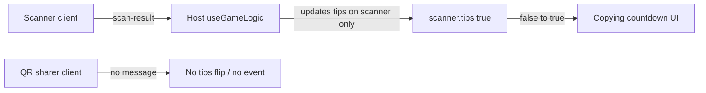

# Verification: Lovable claims vs current codebase

## What is already implemented (verified)

**Batch 1 (original 7 items)**

- **Mock exam individual scoring** — `[src/hooks/useGameLogic.ts](src/hooks/useGameLogic.ts)` applies -2 per chick without a correct `chickClicks[connId]`, +1 only via `event-answer` when correct; `ev.result` is majority cosmetic (lines ~776–801).
- **Mock exam zoom/opacity on PNG layer** — `[src/pages/Client.tsx](src/pages/Client.tsx)`: layer-2 image uses `transform: scale(mockExamZoom)` and `opacity` on the overlay only; camera `MockExamCamera` is separate (lines ~967–974, ~977–988).
- **Mock exam timer** — active event uses `clockNow` for `timeLeft` (line ~912); `clockNow` ticks every 250ms (lines ~334, ~383).
- **Chick props overlap** — `[PropsStackBtn](src/pages/Client.tsx)` is a vertical `flex flex-col gap-2` (lines ~98–135).
- **Eagle fly vs attack cooldown** — `[src/pages/Client.tsx](src/pages/Client.tsx)` passes `Math.max(myState.flyCooldownUntil ?? 0, myState.attackCooldownUntil ?? 0)` into `PropsBtn` (line ~1266). `[EagleControls.tsx](src/components/controls/EagleControls.tsx)` has the same `effectiveFlyCooldown` logic but **is not imported by `Client.tsx`** (only used from `[src/pages/preview/EagleControl.tsx](src/pages/preview/EagleControl.tsx)`); production eagles use the inline layout in `Client.tsx`.
- **LEAVE / disconnect → home** — `disconnect(); navigate("/")` appears for color picker, dead, gameover, and gameplay ✕ (grep shows lines ~816, ~846, ~901, ~1231).

**Batch 2 (follow-up)**

- **Exam timeout draw rules** — `[resolveExamWinner](src/hooks/useGameLogic.ts)` (~938–953) implements 1v3: `C >= 2` chicks win else draw; 2v6: `C >= 3` win else draw.
- **Host transcript DRAW + Play Again** — `[src/pages/Host.tsx](src/pages/Host.tsx)` `GameOverCeremony` transcript table uses yellow `DRAW` when `winner === 'draw'` (~~712–716) and a **PLAY AGAIN** button that `window.location.reload()` (~~727–734).
- **Room code only in lobby** — `[useAdvertiseRoom(phase === 'lobby' ? roomCode : '', mode)](src/pages/Host.tsx)` (~150) clears advertisement after start.
- **Client gameover draw copy** — `[src/pages/Client.tsx](src/pages/Client.tsx)` (~873–900) handles `draw` with yellow styling.
- **Mock exam sliders on two lines** — labels “Zoom” / “Layer” on separate rows (~977–988).

---

## Gaps and fixes (still missing or incomplete)

### 1. Reconnection / takeover code (large feature — not in repo)

Lovable correctly noted this needs **connection-handling + host state** work. Today:

- `[useGameRoom.ts](src/hooks/useGameRoom.ts)` removes a peer on `close` / error; `[useGameLogic.ts](src/hooks/useGameLogic.ts)` keeps `playerStates` but **skips joystick input** when `currentPlayers.get(connId)` is missing (~420–421), so the avatar stays but **cannot be controlled** after disconnect.
- A new join always gets a **new** `connId`; there is no mapping from “takeover code” → existing `playerState`.

**Implementation sketch (when you approve scope):** per-slot `takeoverCode` + `takeoverCodeVersion` in game snapshot or host-only state; host UI under focus camera (blur/reveal); client join flow sends code; host validates and **rebinds** the live connection to the existing `connId` or migrates `playerStates` entry (careful with WebRTC/Supabase both modes). Regenerate code after successful takeover.

### 2. Stage 3 — “copying” countdown when another player scans your QR

The receiver countdown in `[Client.tsx](src/pages/Client.tsx)` (~477–508) only runs when `myState.tips[i]` flips **false → true**.

- By end of stage 2, many lobbies will already have **both** tips `true`, so a scan in stage 3 **does not change** `tips` → **no countdown** (matches your report).
- The **sharer** never gets a `tips[]` change when someone else scans; there is **no** message from `[scan-result](src/hooks/useGameLogic.ts)` (~1180–1205) to `tipShare.connId`.

**Fix direction:** On successful tip-share scan, broadcast a small event (e.g. `tip-share-ack` with `targetConnId`, `tipIndex`, `scannerConnId`) so the **sharer’s** client can start the same 3s “Copying…” UI (and optionally the receiver if you still want both). Alternatively, add server-driven `tipObtainTimers`-style fields for “incoming copy” per connId.

### 3. Final exam — hide layer identity + host layer 1 visibility

- **Client:** Header is already only “FINAL EXAM”; the image still uses `alt={\`Layer ${examLayer}}` (~1114) — use a generic alt (accessibility) with no layer number in user-visible strings.
- **Host:** Layer 1 PNG is shown only when `snapshot.examState?.layer1Dead` (`[Host.tsx](src/pages/Host.tsx)` ~482–489). For multiplayer exams, `layer1Dead` starts **false** (`[startExam](src/hooks/useGameLogic.ts)` ~898–905), so **audience never sees layer 1 on the host** until the holder dies — likely the “layer 1 did not overlay” issue for the **projector/host** view.

**Fix direction:** While `phase === 'exam'` and `examState` is active and not solo (`layer2ConnIds.length > 0`), show the layer-1 PNG in the host overlay (static asset), independent of `layer1Dead`; keep or adjust the existing `layer1Dead` panel if it is still needed for the “holder died” narrative.

### 4. Mobile eagle attack / props cooldown

`[AttackButton.tsx](src/components/AttackButton.tsx)` already shows numeric seconds + SVG ring and uses `touchAction: 'manipulation'`. `[PropsBtn](src/pages/Client.tsx)` shows seconds when `flyOnCooldown`. If devices still show **no** numbers, treat as a **device-specific bug**: check z-index/stacking, `text-foreground` contrast on dark buttons, and whether `cooldownUntil` is 0 due to clock skew. No second code path in production `Client` for eagles besides these components.

### 5. Minor consistency

- **Event countdown** in `[Client.tsx](src/pages/Client.tsx)` uses raw `Date.now()` for `cdSec` (~911) while active phase uses `clockNow` — align to `clockNow` for one clock source.
- **Transcript sorting in preview** — `[TranscriptView.tsx](src/components/TranscriptView.tsx)` sorts winners first without treating `draw` as neutral; `[Host.tsx](src/pages/Host.tsx)` ceremony uses draw-aware sort (~527–531). Only matters if `TranscriptView` is used for real gameover; align if so.

---

## Mermaid: tip-share gap (why stage 3 feels broken)

---

## Recommended order of work

1. **Quick wins:** Host layer-1 overlay during exam; stage-3 tip-share ack for sharer (and/or duplicate-tip case); countdown phase uses `clockNow`; generic final-exam image alt.
2. **Large:** Reconnection takeover design + implementation across `[useGameRoom.ts](src/hooks/useGameRoom.ts)` and `[useGameLogic.ts](src/hooks/useGameLogic.ts)`.
3. **If needed:** Mobile-only QA on `[AttackButton](src/components/AttackButton.tsx)` / `[PropsBtn](src/pages/Client.tsx)` with real devices.

